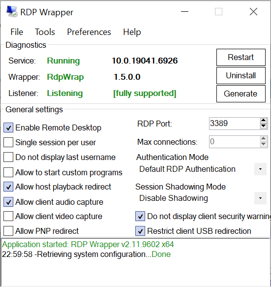

<p align="center">
      
    
</p>

---

<p align="center">
    <a href="https://endoflife.date/windows"></a>
    <a href="https://endoflife.date/windows-server"></a>
</p>

<div align="center">

Это форк проекта [sergiye/rdpWrapper](https://github.com/sergiye/rdpWrapper),
ориентированный на долгосрочную стабильность и безопасность цепочки поставки.  
В нём **устранены географические ограничения**, поэтому
приложение запускается и работает на любой системе вне зависимости от региона, языка
или часового пояса пользователя.  
Зависимости от внешних пакетов зафиксированы по версиям и обновляются
только после ручного аудита изменений в оригинальном проекте. Исключена вероятность превращения проекта в protestware (саботаж, удаление данных и прочие нежелательные сюрпризы) на фоне политических мотивов автора.

</div>

## Описание

`RDP Wrapper` -- это утилита для настройки и конфигурирования RDP.

Этот инструмент вдохновлён проектом [stascorp/rdpwrap](https://github.com/stascorp/rdpwrap),
но написан на чистом .NET вместо Pascal/Delphi.
Основная идея -- создать минималистичную портативную программу со всем необходимым функционалом.

И да, он умеет автоматически генерировать смещения для новых/обновлённых версий Windows -- спасибо проектам [llccd](https://github.com/llccd):
  - [TermWrap](https://github.com/llccd/TermWrap)
  - [RDPWrapOffsetFinder](https://github.com/llccd/RDPWrapOffsetFinder).

RDP Wrapper работает как прослойка между Service Control Manager и Terminal Services, поэтому оригинальный файл `termsrv.dll` остаётся нетронутым. Этот метод также устойчив к обновлениям Windows.

Желательно, чтобы при установке RDP Wrapper в системе был оригинальный `termsrv.dll`. Если он уже был изменён другими патчерами, поведение программы может быть нестабильным.

### Что умеет?

Приложение портативное и обладает следующими возможностями:
  - RDP Wrapper не патчит `termsrv.dll`, а лишь загружает его с другими параметрами
  - RDP-хост на любой редакции Windows начиная с Vista
  - одновременное использование одной и той же учётной записи для локального и удалённого входа (см. конфигурацию)
  - одновременная работа консольной и удалённых сессий
  - включение проброса камеры и USB (если установлен TermWrap)
  - отображение текущего состояния RDP-сервиса
  - настройка параметров RDP
  - установка / удаление враппера
  - генерация конфига для неподдерживаемых ОС (после обновления Windows) -- убедитесь, что установлен [Microsoft Visual C++ Redistributable](https://learn.microsoft.com/en-us/cpp/windows/latest-supported-vc-redist?view=msvc-170#visual-studio-2015-2017-2019-and-2022)
  - проверка обновлений приложения (через системное меню главного окна)
  - «теневое подключение» (RDP shadowing) консольных и RDP-сессий (через [Диспетчер задач в Windows 7](http://cdn.freshdesk.com/data/helpdesk/attachments/production/1009641577/original/remote_control.png?1413476051) и младше, и через [Подключение к удалённому рабочему столу в Windows 8](http://woshub.com/rds-shadow-how-to-connect-to-a-user-session-in-windows-server-2012-r2/) и старше)
  - Windows 2000, XP и Server 2003 не поддерживаются

#### Дополнительные возможности приложения

  - автообновление приложения до последней версии
  - открытие `wrap.ini` в редакторе
  - консольный режим с записью в файл ([#16](https://github.com/sergiye/rdpWrapper/issues/16))
  - выбор места хранения настроек: файл или реестр
  - опциональное добавление исключения в Defender ([#6](https://github.com/sergiye/rdpWrapper/issues/6))
  - опциональное добавление правила брандмауэра при изменении RDP-порта
  - создание пользователя и добавление его в группу RDP ([#9](https://github.com/sergiye/rdpWrapper/issues/9))
  - открытие управления пользователями (новый/старый стиль)
  - проверка наличия Microsoft Visual C++ 2015-2022 Redistributable ([#7](https://github.com/sergiye/rdpWrapper/issues/7))
  - исправление локального кэша учётной записи Microsoft ([#10](https://github.com/sergiye/rdpWrapper/issues/10))
  - настройка отображения/скрытия [предупреждений безопасности клиента](https://learn.microsoft.com/en-us/windows-server/remote/remote-desktop-services/remotepc/understanding-security-warnings)
  - настройка ограничений клиентского проброса USB-устройств

  Также можно выбрать full/lite/x64/x86 сборку приложения -- ту, которая лучше подходит под ваши задачи.

### Как это выглядит?

Скриншот интерфейса приложения на Windows 10:

[](preview.png)

А ещё:
  - `светлая` / `тёмная` темы с автоматическим переключением.
  - поддержка пользовательских `тем` из внешних файлов.

Чтобы добавить свою тему, создайте папку `themes` рядом с исполняемым файлом и положите туда файлы вида `{themeName}.json`.
Пример содержимого пользовательского файла темы:
```json
{
   "DisplayName": "Custom Theme",
   "DarkMode": true,
   "BackgroundColor": "#1E1E1E",
   "ForegroundColor": "#E9E9E9",
   "HyperlinkColor": "#00D980",
   "SelectedBackgroundColor": "#4CBB17",
   "SelectedForegroundColor": "#000000",
   "LineColor": "#262626",
   "StrongLineColor": "#454545",
   "WarnColor": "#FF4500"
}
```
Не забудьте перезапустить приложение, чтобы оно подхватило новые файлы тем!

## Загрузка

Сборки публикуются на [странице релизов](https://github.com/perdakovich/rdpWrapper/releases).

> [!WARNING]
> Microsoft помечают RdpWrapper как «вредоносное ПО». Скорее всего, это связано с финансовыми интересами Microsoft и вытекающим отношением к RdpWrapper, а не с тем, что в нём действительно есть вирус. Метки от Microsoft обычно расходятся и по другим антивирусным вендорам.
> У RdpWrapper исторически бывают ложные срабатывания антивирусов (включая Defender). Вероятно, это связано с его поведением -- например, размещением файлов в `c:\Program Files\` и распаковкой дополнительных библиотек прямо в памяти.

> [!IMPORTANT]
> Если Defender или другой антивирус посчитал какую-то часть RdpWrapper вредоносной, это может помешать работе или привести к тому, что приложение не запустится.
> Если необходимый файл существует, но загрузка его заблокирована -- RdpWrapper не запустится.
> Настоятельно рекомендуется добавить бинарники RdpWrapper в исключения антивируса.


> [!TIP]
> Добавьте в исключения антивируса следующую папку, чтобы избежать проблем из-за ложных срабатываний:
> `c:\Program Files\RDP Wrapper\`

RdpWrapper умеет автоматически добавлять это исключение только в Defender; если по какой-то причине этого не произошло, можно сделать вручную.

Для Defender это можно сделать командой PowerShell от имени администратора:
```powershell
Add-MpPreference -ExclusionPath "c:\Program Files\RDP Wrapper\"
```

> [!CAUTION]
> Если ваш антивирус удаляет скачанный файл приложения, может потребоваться временно отключить защиту в реальном времени или сохранить файл в исключённую папку.
> Если такой подход вас не устраивает или антивирус управляется вашей организацией -- лучше не использовать RdpWrapper и подобрать альтернативу.

## Заметки

### Включение проброса USB
Чтобы заработал проброс USB по RDP, нужно дополнительно включить ряд настроек в групповых политиках (gpedit):

`Конфигурация компьютера\Административные шаблоны\Система\Установка устройств` -- `Разрешить удалённый доступ к интерфейсу Plug and Play` → Включено

`Конфигурация компьютера\Административные шаблоны\Компоненты Windows\Службы удалённых рабочих столов\Узел сеансов удалённых рабочих столов\Перенаправление устройств и ресурсов` -- `Не разрешать перенаправление поддерживаемых устройств Plug and Play` → Отключено

`Конфигурация компьютера\Административные шаблоны\Компоненты Windows\Службы удалённых рабочих столов\Клиент подключения к удалённому рабочему столу\Перенаправление USB-устройств RemoteFX` -- `Разрешить RDP-перенаправление других поддерживаемых RemoteFX USB-устройств с этого компьютера` → Включено

### Заметка о пробросе записи звука
Так же, как и UmWrap, EndpWrap нужен только на серверных и Home-редакциях. Он подгружается во все приложения, которые проигрывают/записывают удалённый звук, и в некоторых «капризных» программах может приводить к зависаниям или падениям.

Для включения проброса записи звука нужно скопировать `EndpWrap.dll` и `Zydis.dll` в `system32`. После этого изменить значение в реестре с `rdpendp.dll` на `EndpWrap.dll`:

`HKEY_LOCAL_MACHINE\SYSTEM\CurrentControlSet\Control\Terminal Server\WinStations\RDP-Tcp\AudioEnumeratorDll`


## Как я могу помочь?

Если вы столкнулись с проблемой, используя эту сборку, сообщите об этом здесь:  
https://github.com/perdakovich/rdpWrapper/issues

Внесите свой вклад в разработку оригинального проекта:  
https://github.com/sergiye/rdpWrapper

Вы можете помочь разработчику здесь:  
https://patreon.com/SergiyE
